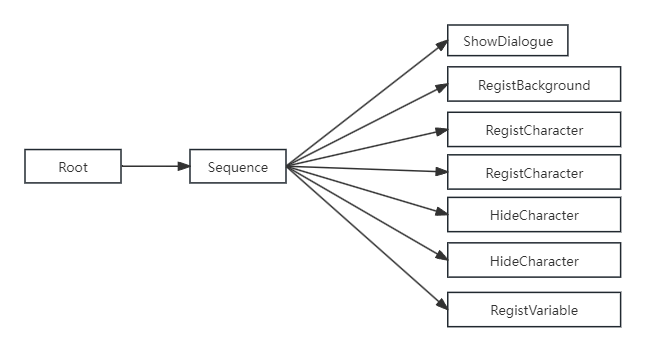

# 对话系统开发笔记
本篇主要记录以下我开发对话系统中的心得和思考，一边写一边整理一下思路(毕竟磨洋工做了两个月，不总结一下都不知道自己做了啥了...)


首先附上本项目的参考: 

[Arc引擎脚本的草记（中文翻译）来自pangaea的博客分享](https://www.bilibili.com/read/cv16416914/?from=search&spm_id_from=333.337.0.0)

[ObjectionMaker](https://objection.lol/maker)

## 传统行为树有什么缺点(我认为的)
项目中的对话系统其实就是行为树，不过相较于传统的行为树做了一些优化。先讲讲传统行为树有什么不足之处。

### 一个方法一个节点


传统行为树会每个方法封装一个节点。比如，Debug.Log会封装成一个Log节点，播放动画一个节点。

一个行为可能会包含一个装饰节点和若干Action节点。比如我想表达"怪物空闲时围绕某个点巡逻并播放行走动画"，如上，要添加动画节点和巡逻节点。目前看起来 还好，也就添加了两个叶节点。那我举一个我在做逆转小剧场时的需求: 进入根节点时，执行如下行为: 
1. 加载对话UI 
2. 加载对话背景
3. 注册一个名为Skye的Character
4. 注册一个名为Phoniex的Character
5. Skye设为不可见
6. Phoniex设为不可见
7. 注册一个随机变量

以传统行为树方式表达上述行为: 



相信聪明如你已经发现了问题。需求越多，添加的叶子节点越多，整棵树会变得越来越大，最后会变得很不好编辑。

### 异步支持差

传统行为树对协程的支持比较原始。比如要同时执行两个任务，传统行为树会给每个节点定义Start(),Update(),Exit()方法。表达协程执行中会用并行节点执行全部子节点的Update。表达等待一段时间执行某个任务会用计时器累加时间，如下:

```csharp
//WaitTimeNode

public float timer;
public float WaitTime = 3.0f;

public void Update()
{
    if(timer > WaitTime) this.Exit();
    timer += Time.DeltaTime;
}
```

如果我们以async，await的方法来表示一个节点的行为：
```csharp
AnimPlay Happy;

if(Numeric Hp > 10)
{
    WaitTime 3000;    //相当于 await 3000ms
    AnimPlay Concern; //从开始执行3000s后播放Concern动画
}

Coroutine:       //启动一个协程
- WaitTime 1000;
- Numeric Hp + 3;
- AnimPlay Sad; // 从开始执行4000s后播放sad动画
WaitTime 3000;  
AnimPlay Write; // 从开始执行6000s后播放Write动画
```

上面的伪代码转成用行为树表达:


可以发现，用代码来表示异步任务更加直观，因为阅读起来是从上到下的。以行为树的表达方式来看，因为分支太多，可读性是很差的(比如，上面这张图就很难分清播放Sad动画和播放Write动画的先后执行顺序)。

### 条件和节点分离


### 方法和数据不分离

开发阶段需要频繁地修改节点执行逻辑。如果不能支持运行时重载逻辑，开发效率太低了。运行时我不用修改数据结构，只要重载方法就行了。大部分行为树方法跟数据都是耦合的，不像ET这样方法数据分离方便做热重载。

## 改进
1. 以帧为单位的行为树

我很喜欢ObjectionMaker中的一个设计，每个节点就是对话中的一帧，同时只有一个节点，也就是只有一帧正在执行，
你可以控制从哪一帧进入对话。

以ECS的思想来设计行为树，每个节点都是一个Entity，节点中包含条件(CheckerConfig)

运行时，每个节点相当于一个协程。

- NodeView(编辑器)
- NodeHandler(逻辑层)
- Node(数据层)

以下是对话携程的主函数:
```csharp
private static async ETTask DialogueCor(this DialogueComponent self)
{
    await TimerComponent.Instance.WaitFrameAsync(); // 意义?: 等待所有reload生命周期事件执行完毕
    if (Application.isEditor) self.ViewStatusReset();

    DialogueNode node = self.GetNode(0); //压入根节点
    self.workQueue.Enqueue(node);
    Unit unit = self.GetParent<Unit>();

    try
    {
        while (self.workQueue.Count != 0)
        {
            if (self.token.IsCancel()) break;
            node = self.workQueue.Dequeue(); //将下一个节点压入queue执行

            self.SetNodeStatus(node, Status.Pending);
            Status ret = await DialogueDispatcherComponent.Instance.Handle(unit, node, self.token);//执行节点
            self.SetNodeStatus(node, ret);

            if (self.token.IsCancel() || ret == Status.Failed) break; //携程取消 or 执行失败
            await TimerComponent.Instance.WaitFrameAsync(self.token);
        }
    }
    catch (Exception e)
    {
        Log.Error(e);
    }
}
```
只关心节点是否执行失败(其他的状态都是编辑器中可视化节点执行结果的，运行时不关心)和对话携程是否被取消。

将Start(),Update(),Exit()合成一个函数。
```csharp
namespace ET.Client
{
    public class RootNodeHandler: NodeHandler<RootNode>
    {
        protected override async ETTask<Status> Run(Unit unit, RootNode node, ETCancellationToken token)
        {
            token.Add(() => { Log.Warning("携程被取消"); }); //携程被取消的回调
            await TimerComponent.Instance.WaitAsync(3000, token);
            if (token.IsCancel()) return Status.Failed; // 携程被取消，就不往后面执行了
            Log.Warning("Hello world");

            DialogueComponent dialogueComponent = unit.GetComponent<DialogueComponent>();
            dialogueComponent.PushNextNode(node.nextNode);

            await ETTask.CompletedTask;
            return Status.Success;
        }
    }
}
```

加强了对异步的支持，也支持协程的取消。热重载对话树的时候，我们可以很容易的取消对话树协程和当前运行的节点子协程，并从根节点进入重新执行对话协程。


异步的更多花样

```csharp
//对ObjectWait不了解的可以看这篇: https://et-framework.cn/d/351-objectwaitentity
namespace ET.Client
{
    public class VN_ActionNodeHandler: NodeHandler<VN_ActionNode>
    {
        protected override async ETTask<Status> Run(Unit unit, VN_ActionNode node, ETCancellationToken token)
        {
            DialogueComponent dialogueComponent = unit.GetComponent<DialogueComponent>();

            WaitNextCor(dialogueComponent, token).Coroutine();
            
            //1. 等待UI点击事件，确认后执行之后的逻辑
            await dialogueComponent.GetComponent<ObjectWait>().Wait<WaitNextNode>(token);
            if (token.IsCancel()) return Status.Failed;
            dlgDialogue.RefreshArrow(); // 隐藏箭头

            //2. 执行下一个节点
            dialogueComponent.PushNextNode(dialogueComponent.GetFirstNode(node.children));
            return Status.Success;
        }

        private static async ETTask WaitNextCor(DialogueComponent self, ETCancellationToken token)
        {
            await TimerComponent.Instance.WaitAsync(200, token);
            if (token.IsCancel()) return;

            //取消等待按键触发的协程
            ETCancellationToken WaitKeyPressedToken = new();
            token.Add(WaitKeyPressedToken.Cancel);

            //刷新UI,显示右箭头
            DlgDialogue dlgDialogue = self.ClientScene().GetComponent<UIComponent>().GetDlgLogic<DlgDialogue>();
            dlgDialogue.RefreshArrow();
            dlgDialogue.ShowRightArrow(() =>
            {
                self.GetComponent<ObjectWait>().Notify(new WaitNextNode());
                WaitKeyPressedToken.Cancel(); // 触发点击事件后，取消检测按键协程
            });

            //检测按键
            while (true)
            {
                if (WaitKeyPressedToken.IsCancel()) return;
                if (Keyboard.current.spaceKey.isPressed)
                {
                    self.GetComponent<ObjectWait>().Notify(new WaitNextNode());
                    token.Remove(WaitKeyPressedToken.Cancel);
                    return;
                }

                await TimerComponent.Instance.WaitFrameAsync(WaitKeyPressedToken);
            }
        }
    }
}
```

BBScript优点: 

1. 方便热重载.

行为树的节点，本质上是将代码封装成一个个节点，这样做，使得节点太多，树太大，不好编辑。

既然ET支持热重载，我的想法是不如把方法封装成指令，运行时可以对指令进行热重载。

项目中的脚本，其实有点像Lua(虽然我没学过，哈哈)。通过指令访问到Entity树上的数据，或者对数据进行操作。
其中ScriptHandler参考的是ET的BehaviorHandler,支持运行时热重载。

```csharp
namespace ET.Client
{
    [FriendOf(typeof (DialogueDispatcherComponent))]
    public static class DialogueDispatcherComponentSystem
    {
        public class DialogueDispatcherComponentLoadSystem: LoadSystem<DialogueDispatcherComponent>
        {
            protected override void Load(DialogueDispatcherComponent self)
            {
                self.Init();
            }
        }

        private static void Init(this DialogueDispatcherComponent self)
        {
            self.checker_dispatchHandlers.Clear();
            var nodeCheckerHandlers = EventSystem.Instance.GetTypes(typeof (NodeCheckerAttribute));
            foreach (Type type in nodeCheckerHandlers)
            {
                NodeCheckHandler nodeCheckHandler = Activator.CreateInstance(type) as NodeCheckHandler;
                if (nodeCheckHandler == null)
                {
                    Log.Error($"this obj is not a nodeCheckerHandler:{type.Name}");
                    continue;
                }

                self.checker_dispatchHandlers.Add(nodeCheckHandler.GetNodeCheckType(), nodeCheckHandler);
            }
        }
    }
}
```

本项目中把一些事件都封装成指令。

```csharp
ShowWindow type = Dialogue;

# 注册演员
VN_RegistCharacter ch = Skye unitId = 1003;
VN_HideCharacter ch = Skye;
VN_RegistCharacter ch = Phoniex unitId = 1003;
VN_HideCharacter ch = Phoniex;

# 注册背景
VN_RegistBackground name = Witness;

# 注册共享变量
RegistRandomVariable min = <Constant name=Min/> max = <Constant name=Max/>;
# Numeric Hp + <Variable name=Random/>;

```

如果你想，把一些指令符合变成一个函数也是完全可以的。

```csharp
namespace ET.Client
{
    public class HoldIt_ScriptHandler : ScriptHandler
    {
        public override string GetOPType()
        {
            return "HoldIt()";
        }

        public override async ETTask Handle(Unit unit, DialogueNode node, string line, ETCancellationToken token)
        {
            var opLines = "HideWindow type = Dialogue;\nVN_RegistEffect name = hold_it prefabName = HoldIt;\nVN_Shake effect = hold_it curve = ShakeCurve duration = ShakeDuration intensity = ShakeIntensity;\nVN_RemoveEffect name = hold_it;\nWaitTime 500;\nShowWindow type = Dialogue;";
            await DialogueDispatcherComponent.Instance.ScriptHandles(unit, node, opLines, token);
        }
    }
}

HoldIt();
```

## 数据
运行时支持访问3种类型的数据:
1. 常量,对话树中。
2. 运行时注册的变量。
3. 其他组件上的数据，例如数值组件。

```csharp
RegistRandomVariable min = <Constant name=Min/> max = <Constant name=Max/>;

Numeric Hp + <Variable name=Random/>;
```

关于变量这个，算是构思的比较久的。


```csharp
 [HideReferenceObjectPicker]
    public abstract class DialogueNode: Object
    {
        [HideInInspector, ReadOnly]
        public uint TreeID;

        [HideInInspector, ReadOnly]
        public uint TargetID;

        [FoldoutGroup("$nodeName"), LabelText("检查前置条件: ")]
        public bool NeedCheck;
        
        [FoldoutGroup("$nodeName"),Space(5),ShowIf("$NeedCheck")]
        public List<NodeCheckConfig> checkList = new();

        [FoldoutGroup("$nodeName"), LabelText("显示脚本: "),Space(5)]
        [BsonIgnore]
        public bool ShowScript;

        [FoldoutGroup("$nodeName"), HideLabel, TextArea(10, 35), ShowIf("ShowScript")]
        public string Script = "";

        [HideInInspector, BsonIgnore]
        public string text;

#if UNITY_EDITOR
        [HideInInspector]
        public string Guid;

        [HideInInspector]
        public Vector2 position;

        [BsonIgnore]
        [HideInInspector, ReadOnly, FoldoutGroup("$nodeName")]
        public Status Status;
        
        [Searchable]
        [FoldoutGroup("$nodeName"), HideReferenceObjectPicker, LabelText("本地化组"), Space(10),
         ListDrawerSettings(ShowFoldout = true, ShowIndexLabels = true, ListElementLabelName = "eleName")]
        public List<LocalizationGroup> LocalizationGroups = new();

        public string nodeName => $"[{TargetID}]{GetType().Name}";

        public string GetContent(Language language)
        {
            //所以我明明new了，为什么odin还会显示null呢?
            if (LocalizationGroups == null) return String.Empty;
            var targetGroup = LocalizationGroups.FirstOrDefault(group => group.Language == language);
            return targetGroup == null? String.Empty : targetGroup.content;
        }

        public virtual DialogueNode Clone()
        {
            DialogueNode cloneNode = MongoHelper.Clone(this);
            cloneNode.TargetID = 0;
            cloneNode.TreeID = 0;
            cloneNode.Guid = GUID.Generate().ToString();
            return cloneNode;
        }
#endif
        //注意MongoBson只支持signed int64
        public long GetID()
        {
            ulong result = 0;
            result |= TargetID;
            result |= (ulong)TreeID << 32;
            return (long)result;
        }

        //ID转成treeID和TargetID
        public void FromID(long ID)
        {
            ulong result = (ulong)ID;
            TargetID = (uint)(result & uint.MaxValue);
            result >>= 32;
            TreeID = (uint)(result & uint.MaxValue);
        }
    }

#if UNITY_EDITOR
    [Serializable]
    public class LocalizationGroup
    {
        [LabelText("语言: "), Space(10)]
        public Language Language = Language.Chinese;

        public string eleName => Language.ToString();

        [TextArea(3, 4), Space(10)]
        [HideLabel]
        public string content = "";
    }
#endif

    public class NodeTypeAttribute: BaseAttribute
    {
        public string Level;

        public NodeTypeAttribute(string level)
        {
            this.Level = level;
        }
    }
}
```