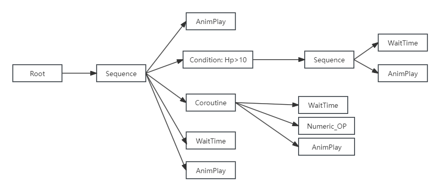

# 对话系统开发笔记
本篇主要记录以下我开发对话系统中的心得和思考，一边写一边整理一下思路(毕竟磨洋工做了两个月，不总结一下都不知道自己做了啥了...)


首先附上本项目的参考: 

[Arc引擎脚本的草记（中文翻译）来自pangaea的博客分享](https://www.bilibili.com/read/cv16416914/?from=search&spm_id_from=333.337.0.0)

[ObjectionMaker](https://objection.lol/maker)

## 传统行为树有什么缺点(我认为的)
项目中的对话系统其实就是行为树，不过相较于传统的行为树做了一些优化。先讲讲传统行为树有什么不足之处。

### 封装的节点太多

传统行为树会每个方法封装一个节点。比如，Debug.Log会封装成一个Log节点，播放动画一个节点。随着需求增加，一个装饰器节点下面的叶子节点会越来越多，且不说性能问题，看起来都很丑陋。


条件判断被抽象成节点。其一有些条件节点可能只在很少的场景下会用到，其二，会增加很多条件判断的分支，可读性差。


以对话系统为例。当我们的对话中有前置条件的检查，不可避免地会增加很多条件判断的分支，可读性变差

### 异步支持差

行为树对协程的支持比较原始。比如WaitTime节点，一般实现如下:
```csharp
//WaitTimeNode

public float timer;
public float WaitTime = 3.0f;

public void Update()
{
    if(timer > WaitTime) this.Exit();
    timer += Time.DeltaTime;
}
```
给每个节点定义Start(),Update(),Exit()方法。行为树中的节点实际上是同步执行的。

如果我们以async，await的方法来表示一个节点的行为：
```csharp
AnimPlay Happy;

if(Numeric Hp > 10)
{
    WaitTime 3000;    //相当于 await 3000ms
    AnimPlay Concern; //从开始执行3000s后播放Concern动画
}

Coroutine:       //启动一个协程
- WaitTime 1000;
- Numeric Hp + 3;
- AnimPlay Sad; // 从开始执行4000s后播放sad动画
WaitTime 3000;  
AnimPlay Write; // 从开始执行6000s后播放Write动画
```

上面的伪代码转成用行为树表达:



可以发现，用代码来表示异步任务更加直观，因为阅读起来是从上到下的。以行为树的表达方式来看，因为分支太多，可读性是很差的(比如，上面这张图就很难分清播放Sad动画和播放Write动画的先后执行顺序)。


### 方法和数据不分离

开发阶段需要频繁地修改节点执行逻辑。如果不能支持运行时重载逻辑，开发效率太低了。运行时我不用修改数据结构，只要重载方法就行了。大部分行为树方法跟数据都是耦合的，不像ET这样方法数据分离方便做热重载。

## 本项目中的改进
### 以节点为单位的行为树

我很喜欢ObjectionMaker中的一个设计，每个节点就是对话中的一帧，同时只有一个节点，也就是只有一帧正在执行，
你可以控制从哪一帧进入对话。

以ECS的思路来设计行为树。

数据层: 
```csharp
public abstract class DialogueNode: Object
{
    public uint TreeID; //对话树的唯一标识ID
    public uint TargetID; //节点在对话树中的唯一标识ID

    //节点在全局的唯一标识ID
    //注意MongoBson只支持signed int64
    public long GetID()
    {
        ulong result = 0;
        result |= TargetID;
        result |= (ulong)TreeID << 32;
        return (long)result;
    }

#region 条件判断相关的数据
    public bool NeedCheck;
    public List<NodeCheckConfig> checkList = new();
#endregion

    // 脚本
    public string Script = "";
    
    //请结合后面的本地化一起看
    [BsonIgnore]
    public string Text;
}
```

```csharp
namespace ET.Client
{
    [NodeType("Visual Novel/Action节点(Visual Novel)")]
    public class VN_ActionNode: DialogueNode
    {
        public List<uint> children = new(); //子节点targetID列表
    }
}
```


编辑器:
```csharp
namespace ET.Client
{
    public sealed class VN_ActionNodeView: DialogueNodeView<VN_ActionNode>
    {
        public VN_ActionNodeView(VN_ActionNode dialogueNode, DialogueTreeView dialogueTreeView): base(dialogueNode, dialogueTreeView)
        {
            GenerateInputPort("", true); //生成输入端口
            Port port = GenerateOutputPort("",true); //生成输出端口
            SaveCallback += () => { dialogueNode.children = GetLinkNodes(port); };  //保存回调
        }
    }
}
```


以下是对话携程的主函数:
```csharp
private static async ETTask DialogueCor(this DialogueComponent self)
{
    await TimerComponent.Instance.WaitFrameAsync(); // 意义?: 等待所有reload生命周期事件执行完毕
    if (Application.isEditor) self.ViewStatusReset();

    DialogueNode node = self.GetNode(0); //压入根节点
    self.workQueue.Enqueue(node);
    Unit unit = self.GetParent<Unit>();

    try
    {
        while (self.workQueue.Count != 0)
        {
            if (self.token.IsCancel()) break;
            node = self.workQueue.Dequeue(); //将下一个节点压入queue执行

            self.SetNodeStatus(node, Status.Pending);
            Status ret = await DialogueDispatcherComponent.Instance.Handle(unit, node, self.token);//执行节点
            self.SetNodeStatus(node, ret);

            if (self.token.IsCancel() || ret == Status.Failed) break; //携程取消 or 执行失败
            await TimerComponent.Instance.WaitFrameAsync(self.token);
        }
    }
    catch (Exception e)
    {
        Log.Error(e);
    }
}
```

一个节点就是一个协程，相当于将将Start(),Update(),Exit()合成一个函数。我们只关心节点是否执行失败(其他的状态都是用于编辑器中可视化节点执行结果的，运行时不关心)和对话携程是否被取消。

```csharp
namespace ET.Client
{
    public class RootNodeHandler: NodeHandler<RootNode>
    {
        protected override async ETTask<Status> Run(Unit unit, RootNode node, ETCancellationToken token)
        {
            token.Add(() => { Log.Warning("携程被取消"); }); //携程被取消的回调
            await TimerComponent.Instance.WaitAsync(3000, token);
            if (token.IsCancel()) return Status.Failed; // 携程被取消，就不往后面执行了
            Log.Warning("Hello world");

            DialogueComponent dialogueComponent = unit.GetComponent<DialogueComponent>();
            dialogueComponent.PushNextNode(node.nextNode);

            await ETTask.CompletedTask;
            return Status.Success;
        }
    }
}
```

加强了对异步的支持，也支持协程的取消。热重载对话树的时候，我们可以很容易的取消对话树协程和当前运行的节点子协程，并从根节点进入重新执行对话协程。


异步的更多花样

```csharp
//对ObjectWait不了解的可以看这篇: https://et-framework.cn/d/351-objectwaitentity
namespace ET.Client
{
    public class VN_ActionNodeHandler: NodeHandler<VN_ActionNode>
    {
        protected override async ETTask<Status> Run(Unit unit, VN_ActionNode node, ETCancellationToken token)
        {
            DialogueComponent dialogueComponent = unit.GetComponent<DialogueComponent>();

            WaitNextCor(dialogueComponent, token).Coroutine();
            
            //1. 等待UI点击事件，确认后执行之后的逻辑
            await dialogueComponent.GetComponent<ObjectWait>().Wait<WaitNextNode>(token);
            if (token.IsCancel()) return Status.Failed;
            dlgDialogue.RefreshArrow(); // 隐藏箭头

            //2. 执行下一个节点
            dialogueComponent.PushNextNode(dialogueComponent.GetFirstNode(node.children));
            return Status.Success;
        }

        private static async ETTask WaitNextCor(DialogueComponent self, ETCancellationToken token)
        {
            await TimerComponent.Instance.WaitAsync(200, token);
            if (token.IsCancel()) return;

            //取消等待按键触发的协程
            ETCancellationToken WaitKeyPressedToken = new();
            token.Add(WaitKeyPressedToken.Cancel);

            //刷新UI,显示右箭头
            DlgDialogue dlgDialogue = self.ClientScene().GetComponent<UIComponent>().GetDlgLogic<DlgDialogue>();
            dlgDialogue.RefreshArrow();
            dlgDialogue.ShowRightArrow(() =>
            {
                self.GetComponent<ObjectWait>().Notify(new WaitNextNode());
                WaitKeyPressedToken.Cancel(); // 触发点击事件后，取消检测按键协程
            });

            //检测按键
            while (true)
            {
                if (WaitKeyPressedToken.IsCancel()) return;
                if (Keyboard.current.spaceKey.isPressed)
                {
                    self.GetComponent<ObjectWait>().Notify(new WaitNextNode());
                    token.Remove(WaitKeyPressedToken.Cancel);
                    return;
                }

                await TimerComponent.Instance.WaitFrameAsync(WaitKeyPressedToken);
            }
        }
    }
}
```

BBScript优点: 

1. 方便热重载.

行为树的节点，本质上是将代码封装成一个个节点，这样做，使得节点太多，树太大，不好编辑。

既然ET支持热重载，我的想法是不如把方法封装成指令，运行时可以对指令进行热重载。

项目中的脚本，其实有点像Lua(虽然我没学过，哈哈)。通过指令访问到Entity树上的数据，或者对数据进行操作。
其中ScriptHandler参考的是ET的BehaviorHandler,支持运行时热重载。

```csharp
namespace ET.Client
{
    [FriendOf(typeof (DialogueDispatcherComponent))]
    public static class DialogueDispatcherComponentSystem
    {
        public class DialogueDispatcherComponentLoadSystem: LoadSystem<DialogueDispatcherComponent>
        {
            protected override void Load(DialogueDispatcherComponent self)
            {
                self.Init();
            }
        }

        private static void Init(this DialogueDispatcherComponent self)
        {
            self.checker_dispatchHandlers.Clear();
            var nodeCheckerHandlers = EventSystem.Instance.GetTypes(typeof (NodeCheckerAttribute));
            foreach (Type type in nodeCheckerHandlers)
            {
                NodeCheckHandler nodeCheckHandler = Activator.CreateInstance(type) as NodeCheckHandler;
                if (nodeCheckHandler == null)
                {
                    Log.Error($"this obj is not a nodeCheckerHandler:{type.Name}");
                    continue;
                }

                self.checker_dispatchHandlers.Add(nodeCheckHandler.GetNodeCheckType(), nodeCheckHandler);
            }
        }
    }
}
```

本项目中把一些事件都封装成指令。

```csharp
ShowWindow type = Dialogue;

# 注册演员
VN_RegistCharacter ch = Skye unitId = 1003;
VN_HideCharacter ch = Skye;
VN_RegistCharacter ch = Phoniex unitId = 1003;
VN_HideCharacter ch = Phoniex;

# 注册背景
VN_RegistBackground name = Witness;

# 注册共享变量
RegistRandomVariable min = <Constant name=Min/> max = <Constant name=Max/>;
# Numeric Hp + <Variable name=Random/>;

```

如果你想，把一些指令符合变成一个函数也是完全可以的。

```csharp
namespace ET.Client
{
    public class HoldIt_ScriptHandler : ScriptHandler
    {
        public override string GetOPType()
        {
            return "HoldIt()";
        }

        public override async ETTask Handle(Unit unit, DialogueNode node, string line, ETCancellationToken token)
        {
            var opLines = "HideWindow type = Dialogue;\nVN_RegistEffect name = hold_it prefabName = HoldIt;\nVN_Shake effect = hold_it curve = ShakeCurve duration = ShakeDuration intensity = ShakeIntensity;\nVN_RemoveEffect name = hold_it;\nWaitTime 500;\nShowWindow type = Dialogue;";
            await DialogueDispatcherComponent.Instance.ScriptHandles(unit, node, opLines, token);
        }
    }
}

HoldIt();
```

## 数据
运行时支持访问3种类型的数据:
1. 常量,对话树中。
2. 运行时注册的变量。
3. 其他组件上的数据，例如数值组件。

```csharp
RegistRandomVariable min = <Constant name=Min/> max = <Constant name=Max/>;

Numeric Hp + <Variable name=Random/>;
```

关于变量这个，算是构思的比较久的。
