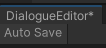

# 对话树视图相关操作

## 复制
Ctrl+z or 右键菜单"复制"。

只支持复制单个节点或者单个组。如果需要复制多个节点和连线关系，请添加到一个组里面。

因为项目是基于mongoBson实现的深拷贝(序列化成bytes后再反序列化成对象)，添加了[BsonIgnore]标签的字段不会被序列化。


如上图，group2由group1复制而来，但是节点类的Status字段添加了[BsonIgnore]标签，复制后的节点状态和原先的节点不同(绿色为执行成功状态，黑色未执行)。

有关节点的序列化反序列化，可以看____。
如果节点的数据结构中有结构体，需要注册到MongoHelper中，否则无法被反序列化。
```csharp
// MongoHelper.cs
// https://et-framework.cn/d/33-mongobson
public static void RegisterStructs()
{
    RegisterStruct<float2>();
    RegisterStruct<float3>();
    RegisterStruct<float4>();
    RegisterStruct<quaternion>();
#if UNITY
    RegisterStruct<Vector2>();
    RegisterStruct<Vector3>();
    RegisterStruct<Vector2Int>();
    RegisterStruct<GradientColorKey>(); // Gradient
    RegisterStruct<Color>();
    RegisterStruct<GradientAlphaKey>();
#endif
}
TODO 自定义序列化类
```
深拷贝的对象会保存在 DialogueSettings单例的copyNode字段，因此支持跨对话树进行黏贴(黏贴到鼠标位置)。

## 黏贴
Ctrl+z or 右键菜单"黏贴"。

默认将对象复制到鼠标位置。

## 保存
Ctrl+s or 右键"保存"。

Ctrl+a or 点左上方的toggle开启/关闭自动保存功能。



## 撤销
Ctrl+z or 右键"撤销"。

因为撤销实际上是刷新视图，部分涉及数据层面的操作不支持撤销，例如创建节点、背景板、常量。

支持缓存删除的节点，背景板，常量或者连线，但注意保存之后缓存会被清空，也就是说只能回溯到上一次保存的状态!

## 移除组
选中节点时可用。用于解除节点和组的父子关系。


## 创建节点
Space or 右键"创建节点"。

搜索视图结构如下: 


### 常用工具

常用工具为除了节点之外的视图元素(如背景板(CommentBlock))。

如何添加创建视图元素?请参考下面的 "背景板2"。

```csharp
public List<SearchTreeEntry> CreateSearchTree(SearchWindowContext context)
{
    var entries = new List<SearchTreeEntry>();
    entries.Add(new SearchTreeGroupEntry(new GUIContent("创建新节点")));
    entries.Add(new SearchTreeGroupEntry(new GUIContent("常用工具")){level = 1});
    entries.Add(new SearchTreeEntry(new GUIContent("背景板")){level = 2, userData = new CommentBlockData()});
    entries.Add(new SearchTreeEntry(new GUIContent("背景板2")){level = 2,userData = new CommentBlockData()});
                
    //生成节点目录树
    LoadDialogueNode(entries);
    return entries;
}
```


### 节点目录树
展示在目录树中的节点需要添加[NodeType]标签，具体如下。
```csharp
namespace ET.Client
{
    //最后一个 / 前面的都是菜单项
    [NodeType("Disco/分支/跳转节点")]
    public class GotoNode : DialogueNode
    {
        [FoldoutGroup("$nodeName/data")]
        [LabelText("跳转到节点: ")]
        public int Goto_targetID;
    }
}
```


## 重载
运行时可用的方法。R or 右键"重载"。

重载会刷新对话树状态，然后重新进入对话树。


## 预览
运行时可用，选中节点时菜单显示该项。

和重载的区别在于，会执行根节点的脚本，然后从选中的节点进入对话树。

解释的不是很清楚。如果你用过objection.lol的话，把对话树的一个节点看成[objectionMaker](https://objection.lol/maker)中的一帧，每一帧都可以进行预览当前帧的执行情况，然后从当前帧往后执行到最后一帧。


