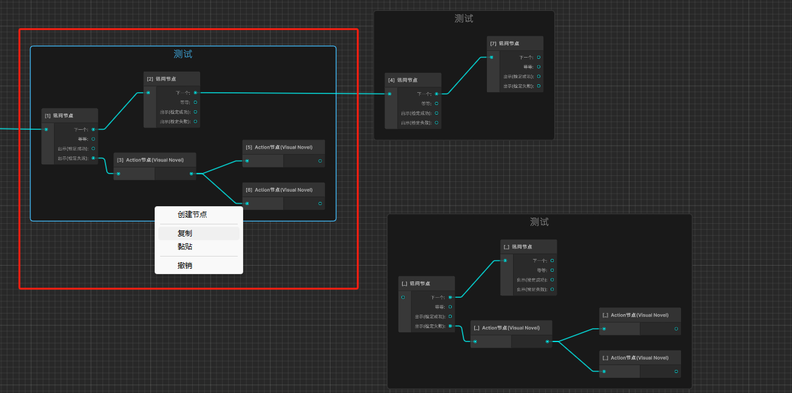
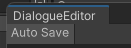
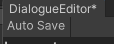
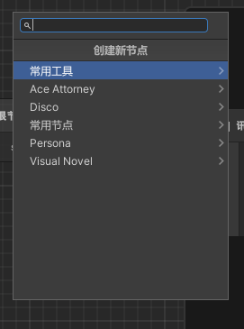
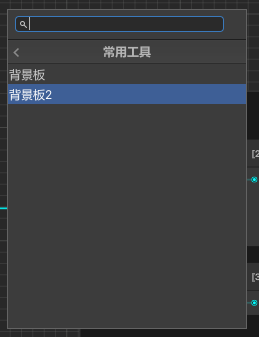
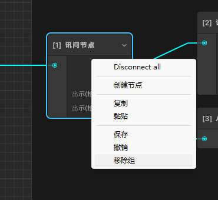

## 参考项目
1. https://github.com/Nition/UnityOctree.git(UnityOctree)

## 对话树视图相关

- 复制

    右键菜单"复制"或者Ctrz+c。

    只支持复制单个节点或者单个组。如果需要复制多个节点和连线关系，请添加到一个组里面。
    
    

    因为项目是基于mongoBson实现的深拷贝(序列化成bytes后再反序列化成对象)，添加了[BsonIgnore]标签的字段不会被复制。如果节点的数据结构中有结构体，需要注册到MongoHelper中。
    ```csharp
    MongoHelper.cs
    // https://et-framework.cn/d/33-mongobson
    public static void RegisterStructs()
    {
        RegisterStruct<float2>();
        RegisterStruct<float3>();
        RegisterStruct<float4>();
        RegisterStruct<quaternion>();
    #if UNITY
        RegisterStruct<Vector2>();
        RegisterStruct<Vector3>();
        RegisterStruct<Vector2Int>(); // 复制节点位置信息
    #endif
    }
    ```

- 黏贴

    右键"黏贴"或者ctrz+v。

    深拷贝的对象会保存在 DialogueSettings单例的copyNode字段，因此支持跨对话树进行黏贴(黏贴到鼠标位置)。

- 保存

    右键"保存"或ctrz+s。
    
    ctrz+a或者点左上角的toggle开启/关闭自动保存功能

    
    
    [这里的描述要完善一下]
    ```csharp
    dialogueEditor.cs

    public bool HasUnSave
    {
        get => hasUnsavedChanges;
        set => hasUnsavedChanges = value;
    }

    public void OnInspectorUpdate()
    {
        if (autoSaveToggle.value && HasUnSave)
        {
            treeView.SaveDialogueTree();
        }

        treeView.RefreshNodeState();
    }
    ```

    ```csharp
    dialogueTreeView.cs
    //标记一下视图中有修改
    public void SetDirty(bool HasUnSave = true)
    {
        window.HasUnSave = HasUnSave;
    }
    ```

    

- 撤销

    右键"撤销"或者ctrz+z。撤销实际上是不保存更改然后刷新视图。

- 创建节点

    右键"创建节点"或空格打开搜索框。

    搜索视图结构如下: 

    

    常用工具里是除了节点之外的视图元素(如背景板(CommentBlock))。

    如何添加创建视图元素?请参考下面的 "背景板2"。
    ```csharp
    public List<SearchTreeEntry> CreateSearchTree(SearchWindowContext context)
    {
        var entries = new List<SearchTreeEntry>();
        entries.Add(new SearchTreeGroupEntry(new GUIContent("创建新节点")));
            
        //除了节点之外的视图元素
        entries.Add(new SearchTreeGroupEntry(new GUIContent("常用工具")){level = 1});
        entries.Add(new SearchTreeEntry(new GUIContent("背景板")){level = 2, userData = new CommentBlockData()});
        //在这里添加常用工具
        entries.Add(new SearchTreeEntry(new GUIContent("背景板2")){level = 2,userData = new CommentBlockData()});
            
        
        //生成节点目录树
        this.LoadDialogueNode(entries);
        return entries;
    }
    ```

    

    节点目录树

    没有添加NodeType的节点不会显示在目录树中。

    注意，NodeType中会将最后一级取为节点在目录树中的名称，前面的全部为菜单项。

    节点数据结构
    ```csharp
    [NodeType("Disco/分支/愤怒节点（延时显示其他选项）")]
    public class Angry_ChoiceNode: DialogueNode
    {
        [FoldoutGroup("$nodeName")]
        [OdinSerialize, LabelText("愤怒"), ReadOnly, HideReferenceObjectPicker]
        [ListDrawerSettings(IsReadOnly = true)]
        public List<uint> Angrys = new();
        [FoldoutGroup("$nodeName")]
        [OdinSerialize, LabelText("情绪正常"), ReadOnly, HideReferenceObjectPicker]
        [ListDrawerSettings(IsReadOnly = true)]
        public List<uint> Normal = new();

        public override DialogueNode Clone()
        {
            Angrys.Clear();
            Normal.Clear();
            return base.Clone();
        }
    }
    ```

    节点视图类
    
    注意!! 必须添加NodeEditorOf标签。
    ```csharp
    [NodeEditorOf(typeof (Angry_ChoiceNode))]
    public sealed class Angry_ChoiceNodeView: DialogueNodeView
    {
        private readonly Port Angry;
        private readonly Port Normal;

        public Angry_ChoiceNodeView(DialogueNode node, DialogueTreeView treeView): base(node, treeView)
        {
            GenerateInputPort("", true);
            Angry = GenerateOutputPort("in anger", true);
            Normal = GenerateOutputPort("normal", true);

            SaveCallback += Save;
        }

        private void Save()
        {
            if (!(node is Angry_ChoiceNode angryChoiceNode)) return;
            angryChoiceNode.Angrys = GetLinkNodes(Angry);
            angryChoiceNode.Normal = GetLinkNodes(Normal);
        }
    }
    ```


- 取消全部连线(grapghview自带功能)
    
    

- 移除组

    取消组和节点的父子关系。(不支持撤销)

    


三种访问数据的方式
1. 查数据树上的其他组件的数据(或者一些全局的配置)。 <Numeric type=Hp/> <--- NumericComponent <UnitConfig id=1001 name/> <--- configLoader
2. 访问对话树上的共享变量。<Variable name=variable/>
3. 节点内的数据 {{Courage}} {{Random}}